**1. Введение и актуальность**

В рамках финального проекта разработано пользовательское расширение `pg_llm_utils` для СУБД PostgreSQL (версия 17). Актуальность работы обусловлена растущей потребностью в интеграции больших языковых моделей (LLM) и алгоритмов машинного обучения непосредственно в транзакционные базы данных (in-database AI). Традиционный подход требует создания отдельных промежуточных микросервисов для извлечения данных, их векторизации и отправки в LLM. Разработанное расширение решает эту проблему, позволяя выполнять задачи обработки естественного языка (NLP) и реализовывать конвейер Retrieval-Augmented Generation (RAG) исключительно средствами SQL-запросов. 

В качестве предметной области и тестового набора данных использован публичный датасет бразильской электронной коммерции Olist (около 100 000 строк). Расширение обладает высоким потенциалом для повторного использования: предложенная архитектура семантического кэширования и вызова API универсальна и может применяться аналитиками или инженерами данных в любых других проектах для классификации текстов, анализа тональности или построения корпоративных Q&A-систем без выгрузки данных из контура СУБД.

**2. Инструкция по развертыванию и запуску (Zero-to-Production)**

Развертывание системы максимально автоматизировано с использованием контейнеризации. Инфраструктура автоматически разворачивает СУБД, загружает исходные данные датасета и подготавливает среду для компиляции расширения.

1. **Подготовка окружения и данных:** 
   * Поместить CSV-файлы датасета Olist в директорию `./data/` в корне проекта.
   * Создать файл `.env` со следующим содержимым:
     ```env
     GROQ_API_KEY=ваш_токен_groq_api
     DB_POSTGRES=admin
     DB_PASSWORD=admin
     ```
2. **Запуск контейнера:**
   Выполнить команду: `docker compose up -d --build`. 
   *Примечание: При первом старте Docker автоматически выполнит скрипт `init_olist.sql` (проброшенный через `/docker-entrypoint-initdb.d/`), который создаст DDL-схемы для 9 таблиц и выполнит `COPY` данных из CSV в БД.*
3. **Установка расширения:**
   Зайти в контейнер и скомпилировать расширение средствами PGXS:
   ```bash
   docker exec -it pg_llm_db bash
   cd /pg_extension
   make install
   ```
4. **Активация и тестирование:**
   Подключиться к БД и запустить демонстрационный скрипт:
   ```bash
   psql -U admin -d olist_db
   CREATE EXTENSION IF NOT EXISTS pg_llm_utils;
   \i /pg_extension/demo.sql
   ```

**3. Инфраструктура проекта**

Для реализации надежной и воспроизводимой архитектуры использован следующий стек технологий:

| Компонент | Версия / Описание | Назначение |
| :--- | :--- | :--- |
| **PostgreSQL** | 17 (Debian) | Базовое транзакционное хранилище данных. |
| **pgvector** | 0.4.2 | Системное расширение для хранения и поиска по векторным эмбеддингам. |
| **PL/Python3u** | PostgreSQL module | Процедурный язык для реализации AI-логики внутри СУБД. |
| **Python** | 3.13.5 | Изолированная среда выполнения скриптов внутри контейнера БД. |
| **Groq SDK / API** | 1.1.1 / `llama-3.1-8b` | Облачный провайдер LLM со сверхбыстрым инференсом для генерации ответов. |
| **Sentence-Transformers** | 3.0.4 | Библиотека для локальной генерации эмбеддингов (`paraphrase-multilingual-MiniLM-L12-v2`). |
| **Docker / Compose** | 3.8 | Оркестрация среды, проброс портов и переменных окружения (secure secrets). |

**4. Состав и архитектура расширения**

Кодовая база расширения (более 130 строк) организована по стандартам PostgreSQL (файлы `pg_llm_utils.control`, `Makefile`, `pg_llm_utils--1.0.sql`). Основная логика инкапсулирована в следующих объектах БД:

*   **Таблицы:** 
    *   `llm_cache` — реализует механизм кэширования ответов LLM на основе MD5-хэша промпта. Снижает задержки и экономит квоты API.
    *   `review_embeddings` — хранилище для текстов отзывов и их векторных представлений (тип `vector(384)`).
*   **Функции и процедуры:**
    *   `groq_chat(prompt, model)` — осуществляет HTTP-вызов к API Groq через библиотеку Python `requests/groq`. Содержит логику проверки локального кэша БД с использованием модуля `plpy`.
    *   `generate_embedding(text)` — локально преобразует текст в числовой вектор. Модель машинного обучения загружается непосредственно в оперативную память (RAM) СУБД с помощью глобального словаря `GD` (Global Dictionary), что исключает накладные расходы на инициализацию при массовой обработке.
    *   `vectorize_reviews(limit)` — хранимая PL/pgSQL процедура для пакетного расчета эмбеддингов по историческим данным.
    *   `ask_olist(question)` — основная функция бизнес-логики (RAG-пайплайн).

**5. Математические и алгоритмические методы**

В ядре системы применяются методы обработки естественного языка и вычислительной геометрии:

*   **Векторные представления (Text Embeddings):** Метод преобразования семантики текста в плотное векторное пространство непрерывных чисел $\mathbb{R}^n$. В проекте используется мультиязычная модель-трансформер, кодирующая как португальские, так и русские тексты в единое пространство размерностью $n = 384$. 
*   **Косинусное сходство (Cosine Similarity):** Метрика близости между двумя векторами в многомерном пространстве. Определяется как косинус угла между ними:
    $$\text{similarity} = \cos(\theta) = \frac{\mathbf{A} \cdot \mathbf{B}}{\|\mathbf{A}\| \|\mathbf{B}\|}$$
    В СУБД данный математический аппарат аппаратно ускорен оператором `<=>` расширения `pgvector`. Чем меньше косинусное расстояние, тем ближе по смыслу отзывы в базе ($\mathbf{A}$) к вопросу пользователя ($\mathbf{B}$).
*   **Retrieval-Augmented Generation (RAG):** Алгоритм преодоления галлюцинаций LLM. Векторный поиск извлекает из БД наиболее релевантные факты (K-Nearest Neighbors), которые динамически внедряются в контекст запроса (Prompt) перед его отправкой в генеративную нейросеть.

**6. Демонстрация работы**

*Скрипт `demo.sql` демонстрирует ключевые возможности расширения.*
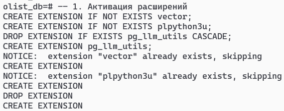

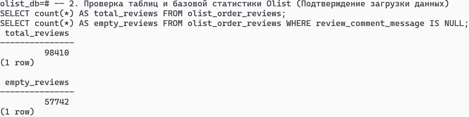

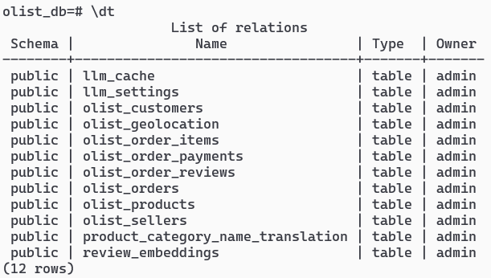


**Пример 1: Интеллектуальное кэширование запросов.**
При вызове функции `groq_chat` система обращается к API и переводит сложный отзыв. При повторном выполнении идентичного запроса ответ возвращается мгновенно, а СУБД выдает системное уведомление `NOTICE: Groq API: Результат взят из кэша (хэш: ...)`.

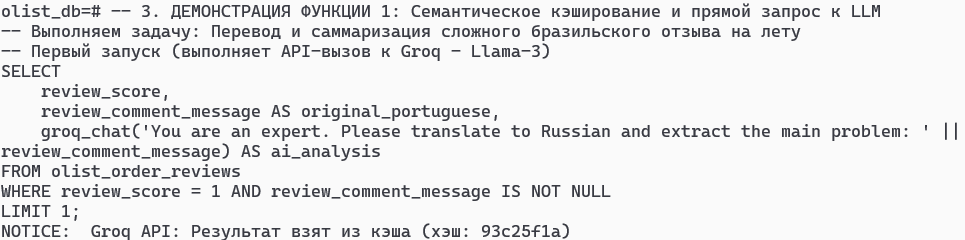

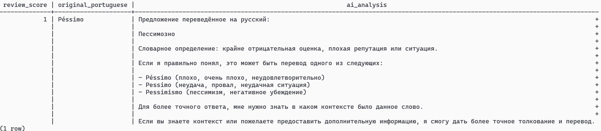


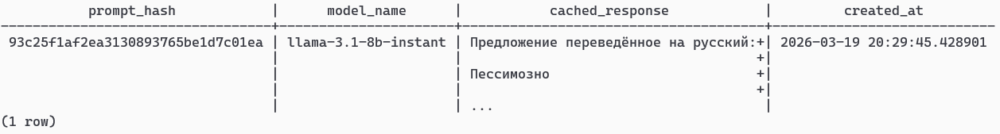


**Пример 2: In-Database векторизация.**
Функция `generate_embedding` инициализирует ML-модель в памяти сервера БД и возвращает математический массив на 384 размерности напрямую в SQL-вывод.
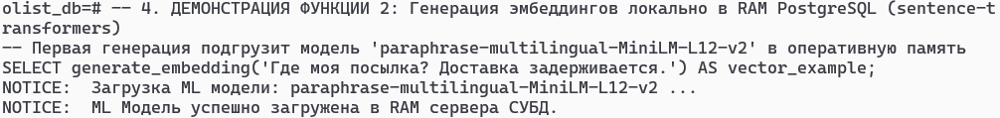

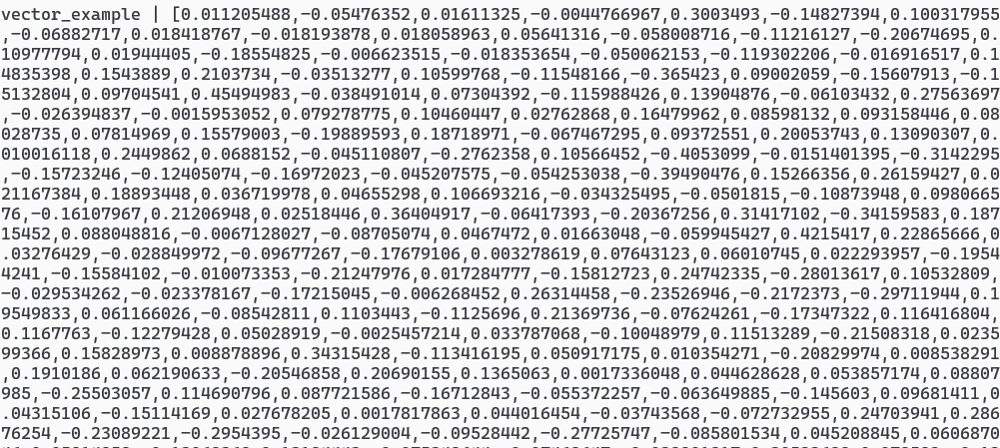

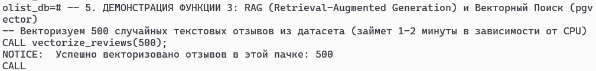
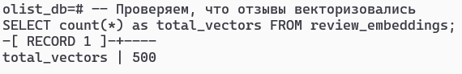
**Пример 3: Кросс-языковой семантический RAG-поиск.**
Выполняется вызов прим.:`SELECT ask_olist('На что чаще всего жалуются клиенты при низких оценках?');`. СУБД векторизует вопрос на русском, находит через математический индекс отзывы бразильцев на португальском языке (например, "baixa qualidade" — низкое качество), агрегирует их, и Llama-3 возвращает аналитический структурированный ответ на русском языке.
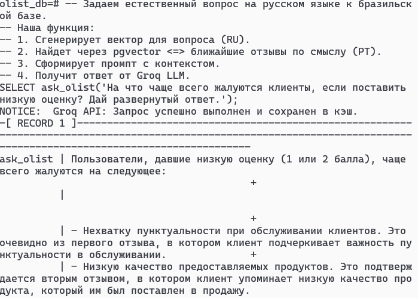

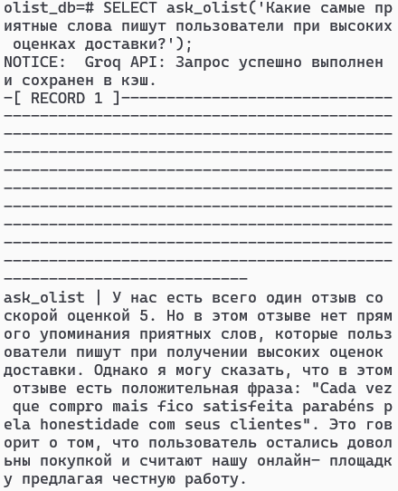

**7. Выводы (Рефлексия)**

В ходе выполнения финальной работы спроектировано и реализовано полноценное расширение для PostgreSQL. Требования к объему кода, самостоятельности метода и практической применимости полностью выполнены. 
Решена нетривиальная инженерная задача объединения реляционного движка с возможностями векторного поиска (pgvector) и вызовами внешних LLM-сервисов с локальным кэшированием (PL/Python). Разработанный RAG-конвейер позволяет проводить сложную кросс-языковую аналитику текстовых массивов напрямую из SQL-консоли. Проект имеет высокую модульность, легко переносится на другие серверы благодаря Docker и готов к интеграции в реальные ETL-процессы или BI-системы как законченный Data Engineering продукт.